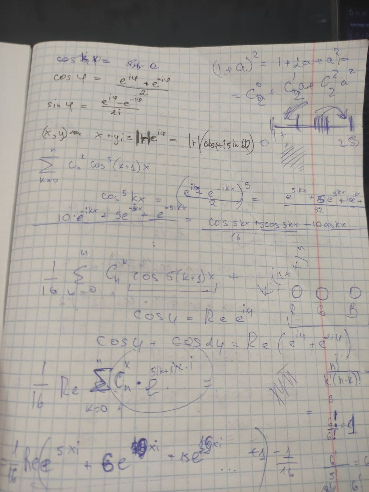
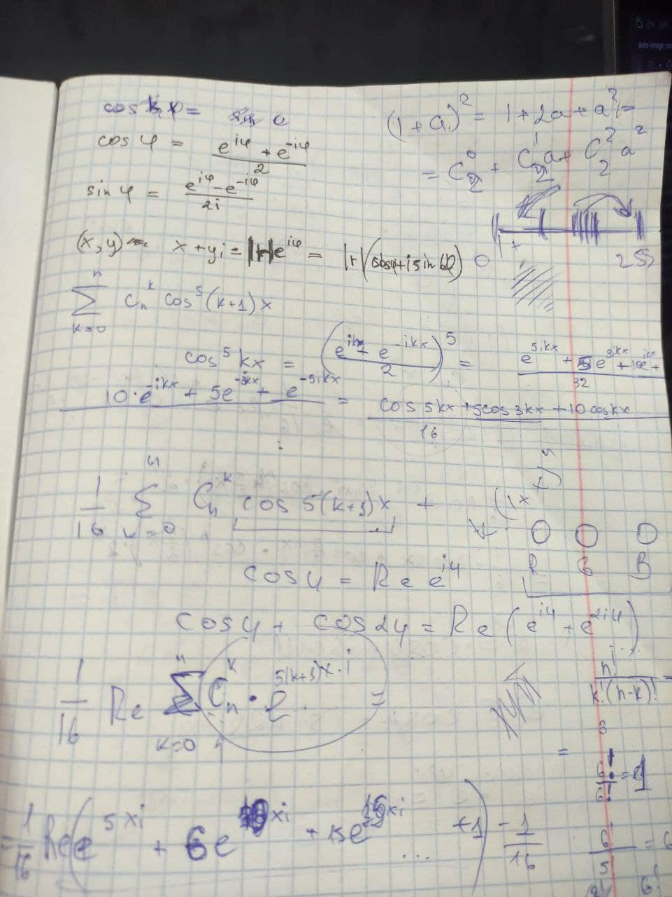
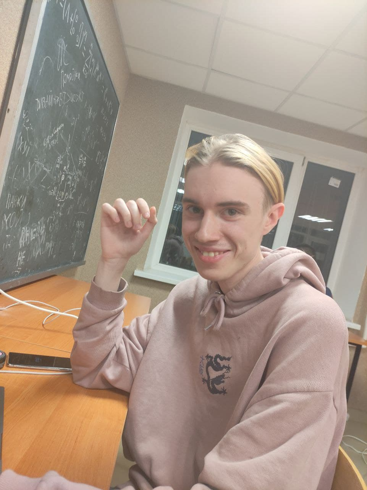
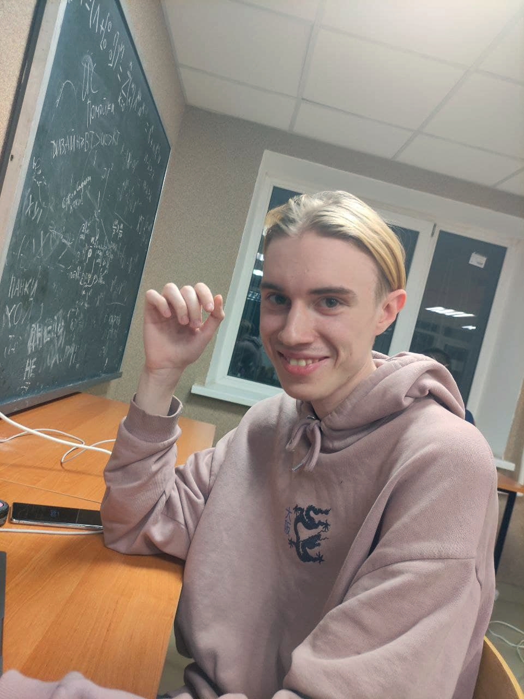

# Auto-contrast Pnm images

Realize P6 and P5 formats.

## Results:
```
DELTA_TIME: 3.57 s, __open_file

Image data:
Current format: P6(Ppm)
Width: 3100
Height: 2050
Max value: 255

DELTA_TIME: 15.29 s, __load_channels

Current value: [min. max]
channel R: [0, 255]
channel B: [0, 255]
channel G: [0, 255]

DELTA_TIME: 20.09 s, __processing_and_save

DELTA_TIME: 39.16 s, main
```
* Before:

* After:


It is a big photo with 3100x2050px.
Photo have normalized channel's values. 
Then program do nothing. But we can shift min, max value:
```python
INF = 256
def min_max_normalize(self):
    if self.R_MAX == INF:
        self.R_MAX = 250
    if self.R_MIN == 0:
        self.R_MIN = 5

    if self.G_MAX == INF:
        self.G_MAX = 250
    if self.G_MIN == 0:
        self.G_MIN = 5

    if self.B_MAX == INF:
        self.B_MAX = 250
    if self.B_MIN == 0:
        self.B_MIN = 5
```

* Before:

* After:


* Before:

* After:



## Start
For use program you need paste your path for photo in main.py.

```python
image = im.Image('input_path')
image.auto_contrast('output_path')
```

## Small description of the modules

* ### Image 
    The main class that calls all the necessary methods. 
    
    I use this class for make scenario for program.

* ### Pixels
    This class contains all pixels from file. And unites :
    
    * **PpmPixels**

    * **PgmPixels**
    
    Also, this class does all algorithms: 
    * find: min, max
    * calculate current color in channel

* ### Timer
    This class use for timing function
